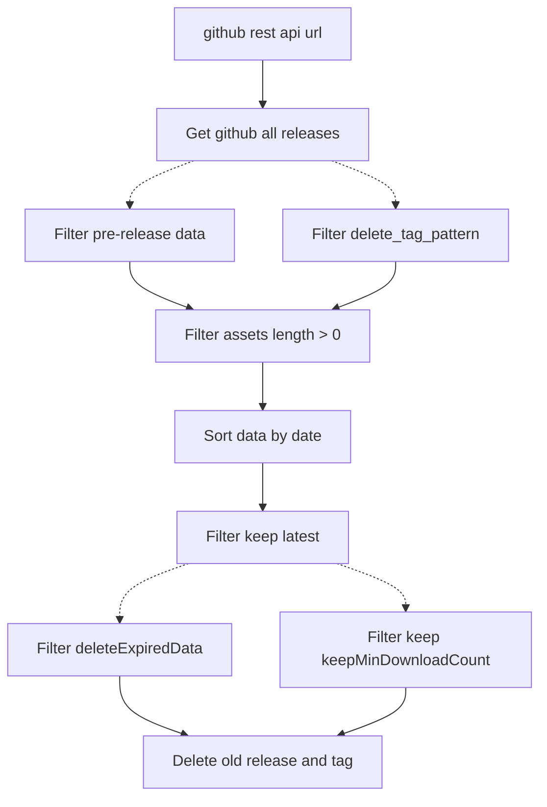

# GitHub Action: Delete older releases

This action deletes older releases of given repo

Add following step to your workflow:

```yaml
- uses: dev-drprasad/delete-older-releases@v0.3.2
  with:
    repo: <owner>/<repoName> # defaults to current repo
    keep_latest: 3
    keep_min_download_counts: 1 # Optional parameters
    delete_expired_data: 10 # Optional parameters
    delete_tag_pattern: beta # defaults to ""
  env:
    GITHUB_TOKEN: ${{ secrets.GITHUB_TOKEN }}
```

### Available Options

#### `keep_latest`

| required |
| -------- |
| true     |

Specifies number of latest releases (sorted by `created_at`) to keep. Pass `0` if you want to delete all releases

#### `keep_min_download_counts`

| required | default |
| -------- | ------- |
| false    |    0    |

Specifies the number of downloads that versions must have at minimum, otherwise they will be removed ....

#### `delete_expired_data`

| required | default |
| -------- | ------- |
| false    |    0    |

To delete data that exceeds the specified number of days, please enter the number of overdue days. For example, setting the value to 10 will delete release data created more than 10 days ago. Note that this parameter is based on keep latest.

#### `delete_tags`

| required | default |
| -------- | ------- |
| false    | false   |

Specifies whether to delete tags associated to older releases or not. Older tags without any associated releases will not be deleted

#### `delete_prerelease_only`

| required | default |
| -------- | ------- |
| false    | false   |

Delete only prereleases

#### `repo`

| required | default               |
| -------- | --------------------- |
| false    | repo executing action |

Repo name in the format of `<owner>/<repoName>`. Defaults to the repo that executing this action

#### `delete_tag_pattern`

| required | default      |
| -------- | ------------ |
| false    | empty string |

Specifies a release **tag** (not title) Regex string pattern to match. If not specified, then every release will be targeted. If specified, then every release containing the pattern will be targeted. Examples, `beta`, `^v2\..*-beta$`, `v3\.0.*`

#### `github_rest_api_url`

| required | default      |
| -------- | ------------ |
| false    |api.github.com|

Github rest api url, the default is "api.github.com". If you are an enterprise user, you can replace it with "{your-github-enterprise-url}/api/v3". Please refer to: https://docs.github.com/en/enterprise-cloud@latest/rest

### Flow Chart (mermaid format)


